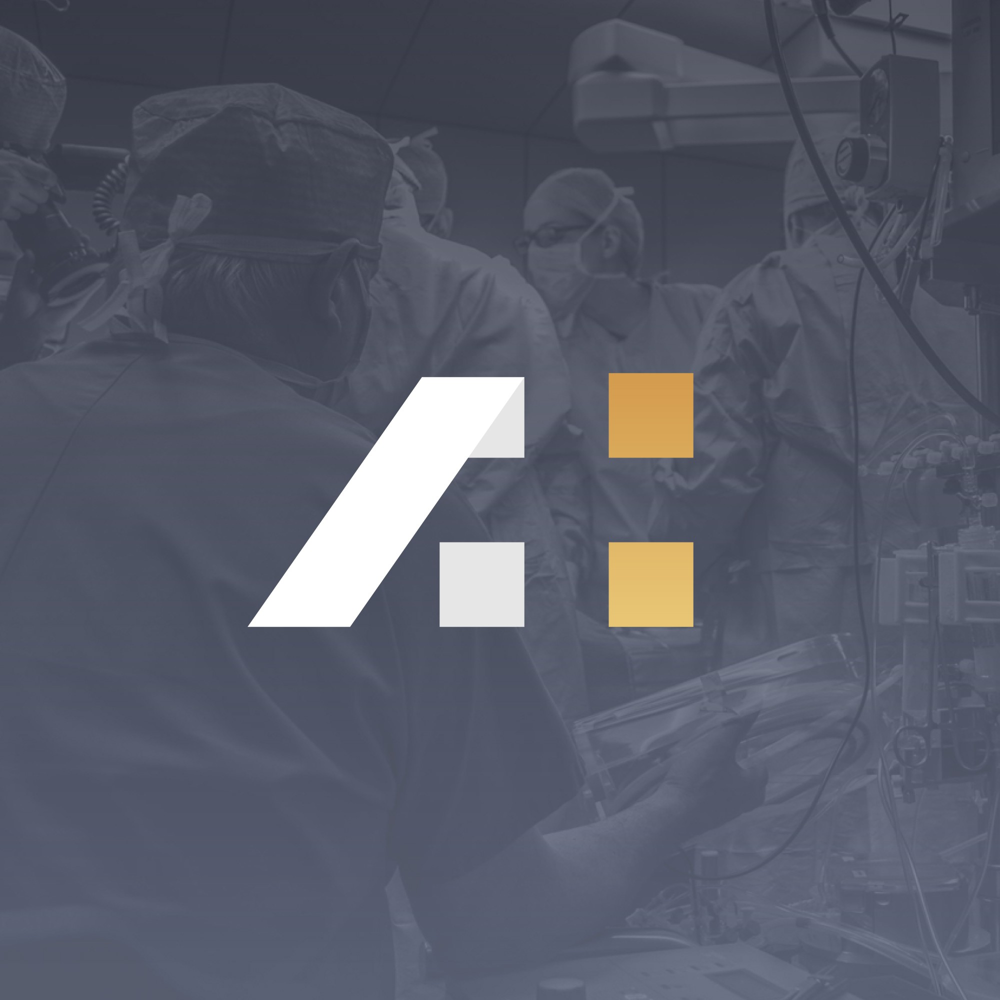

<div align="center">

  

  # 🌟 Mohammad Amaan Bhat — Developer Portfolio

  **A modern, responsive, and interactive portfolio showcasing full-stack development work, frontend design, and technical skills.**

  <p align="center">
    <a href="https://amaandev.me"><strong>🌐 Live Website: amaandev.me</strong></a> •
    <a href="https://github.com/Friedayy"><strong>GitHub</strong></a> •
    <a href="https://www.linkedin.com/in/frieday/"><strong>LinkedIn</strong></a> •
    <a href="mailto:amaandev253@gmail.com"><strong>Email</strong></a>
  </p>

  <p align="center">
    
    
    
    
    
  </p>

</div>

---

## 📖 Overview

This repository contains the source code for the personal portfolio of **Mohammad Amaan Bhat**. Built with vanilla **HTML5**, **CSS3**, and **JavaScript**, the site features a sleek dark mode by default, glassmorphic UI elements, smooth micro-interactions, and responsive design across all devices.

---

## ✨ Key Features

* **🌓 Dynamic Dark / Light Mode**:
  * Default dark aesthetic with seamless toggle via sun/moon icon.
  * Preferences persisted across sessions using browser `localStorage`.
* **🔥 Interactive Hero Section**:
  * **Live Status Badge**: Pulsing *"Available for Opportunities"* real-time availability indicator.
  * **Typing Animation**: Dynamic role title rotation powered by `Typed.js` (*Designer*, *Gamer*, *Developer*).
  * **Stats Strip**: Glassmorphic quick highlights showing years of experience, projects, and commitment.
  * **Avatar Glow & Floating Badges**: Glowing radial backdrop with floating animated skill pills (*Full Stack*, *Open to Work*).
* **🎨 Modern Visual Design**:
  * Ambient floating parallax gradient blobs for depth.
  * Glassmorphism cards with subtle borders and backdrop blur effects.
* **📂 Featured Projects Showcase**:
  * Interactive cards linking directly to GitHub repositories.
  * Smooth cyan slide-up hover effect, external link indicator badges, and keyboard accessibility (<kbd>Enter</kbd> / <kbd>Space</kbd>).
* **🛠️ Technical Skills Grid**:
  * Categorized frontend technologies (*HTML, CSS, JavaScript, React, Tailwind*).
  * Backend technologies (*Node.js, Express, MongoDB, SQL*).
* **📜 Smooth Scroll & Navigation Enhancements**:
  * **Scroll Progress Bar**: Real-time gradient progress tracker pinned to the top.
  * **Dynamic Sticky Header**: Glassmorphism backdrop blur and height transition on scroll.
  * **Scroll-Spy**: Active menu indicators that update as sections are traversed.
  * **Back-to-Top Button**: Smooth floating return button appearing past 350px scroll depth.
* **📱 100% Responsive Layout**:
  * Adaptive design optimized for desktop, tablet, and mobile with a custom sliding drawer menu.

---

## 🛠️ Tech Stack & Libraries

| Technology | Purpose |
| :--- | :--- |
| **HTML5** | Semantic structure and SEO-friendly markup |
| **CSS3 (Vanilla)** | Custom responsive layout, CSS variables, keyframe animations, glassmorphism |
| **JavaScript (ES6+)** | Theme toggling, scroll progress tracking, DOM interactions, accessibility |
| **[Typed.js](https://github.com/mattboldt/typed.js/)** | Dynamic typewriter text animation in hero |
| **[ScrollReveal](https://scrollrevealjs.org/)** | Smooth scroll-triggered reveal animations |
| **[Unicons](https://iconscout.com/unicons)** | Vector line icons for actions, skills, and social links |

---

## 📁 Repository Structure

```plaintext
portfolio/
├── CNAME               # Custom domain configuration (amaandev.me)
├── index.html          # Main application markup & sections
├── style.css           # Global stylesheets, themes, animations & media queries
├── main.js             # Client logic, theme persistence, scroll features & animations
├── images/             # Profile avatar, logo & media assets
│   ├── favicon.svg     # Stylized vector 'a.' brand favicon
│   ├── favicon.png     # High-resolution brand icon
│   ├── og-preview.png  # 1200x630 Open Graph & Twitter share banner
│   ├── logo.jpg
│   └── me.jpeg
└── README.md           # Project documentation
```

---

## 🚀 Showcased Projects

| Project | Description | Stack / Link |
| :--- | :--- | :--- |
| **[Ledger](https://github.com/Friedayy/Expense-tracker-ledger)** | Real-time expense tracker ledger to monitor income, expenses, and balance | [Repository](https://github.com/Friedayy/Expense-tracker-ledger) |
| **[ShopHub](https://github.com/Friedayy/ecommerce-platform)** | Modern full-stack e-commerce web app with product listings, cart & checkout | [Repository](https://github.com/Friedayy/ecommerce-platform) |
| **[React Apps](https://github.com/Friedayy/react-projects)** | Collection of modern interactive frontend applications and UI experiments | [Repository](https://github.com/Friedayy/react-projects) |

---

## 💻 Running Locally

To run and preview the portfolio locally:

1. **Clone the repository:**
   ```bash
   git clone https://github.com/Friedayy/Portfolio.git
   cd Portfolio
   ```

2. **Open in browser:**
   * Simply double-click `index.html` to open it in your default web browser, **or**
   * Use a local development server:
     ```bash
     # Using Python 3
     python3 -m http.server 5500
     ```
     Then navigate to `http://localhost:5500` in your browser.

---

## 📬 Connect with Me

* **Website**: [amaandev.me](https://amaandev.me)
* **GitHub**: [@Friedayy](https://github.com/Friedayy)
* **LinkedIn**: [Mohammad Amaan Bhat](https://www.linkedin.com/in/frieday/)
* **Twitter / X**: [@bhatAmaan_](https://x.com/bhatAmaan_)
* **Instagram**: [@_bhatamaan_](https://www.instagram.com/_bhatamaan_/)
* **Email**: [amaandev253@gmail.com](mailto:amaandev253@gmail.com)

---

<div align="center">
  <sub>Built with ❤️ by <a href="https://github.com/Friedayy">Mohammad Amaan Bhat</a></sub>
</div>
